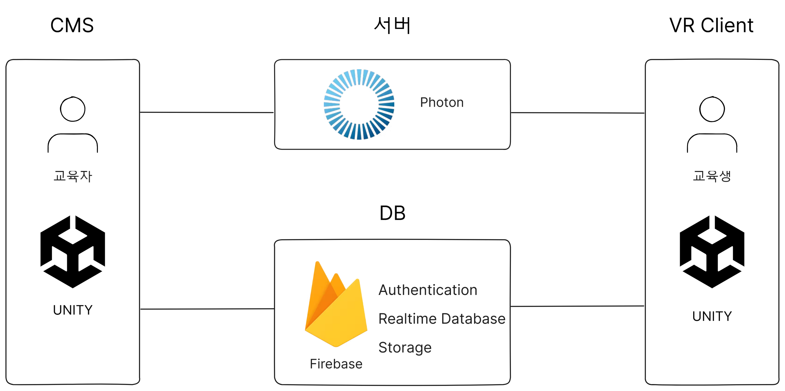
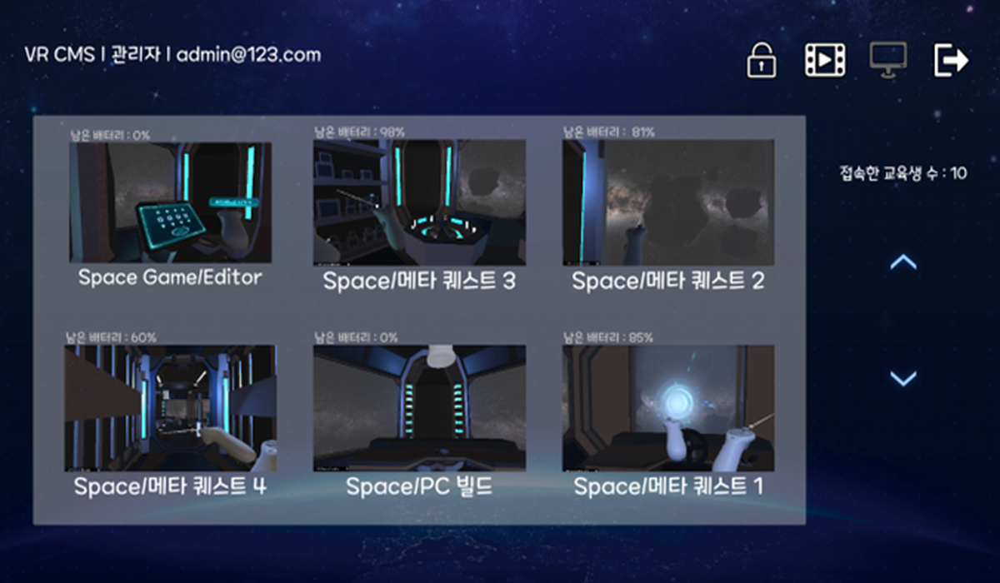
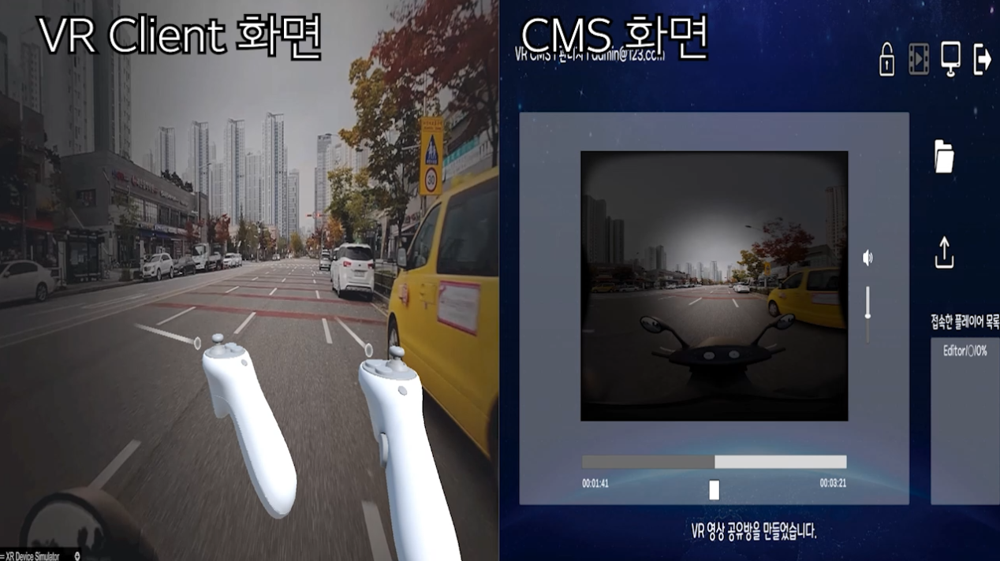

## 개요
<table>
  <tr>
    <td>
      <table>
        <tr><td><strong>기간</strong></td><td>2024.10 ~ 2024.12</td></tr>
        <tr><td><strong>인원</strong></td><td>2인(클라이언트 1, 서버 및 DB 1)</td></tr>
        <tr><td><strong>역할</strong></td><td>팀장, 서버, DB</td></tr>
        <tr><td><strong>도구</strong></td><td>UNITY, C#, PHOTON, FIREBASE</td></tr>
        <tr><td><strong>타겟 기기</strong></td><td>VR</td></tr>
        <tr><td><strong>참여 활동</strong></td><td>2024 SW 캡스톤디자인 경진대회 (장려상)</td></tr>
      </table>
    </td>
    <td style="vertical-align: top; padding-left: 20px;">
      
    </td>
  </tr>
</table>

## 프로젝트 소개
VR 콘텐츠가 교육 현장에 활용되는 사례가 증가함에 따라, 교육자와 학습자 간의 상호작용 부족, 학습 활동 모니터링의 어려움, 수업 준비 시간 증가 등의 문제점이 지속적으로 제기되고 있습니다.

본 프로젝트는 이러한 문제를 해결하기 위해, VR 환경에서 학습자의 활동을 실시간으로 모니터링하고, 콘텐츠를 동기화하여 제공할 수 있는 VR 콘텐츠 관리 시스템(VR CMS)을 개발하는 것을 목표로 하였습니다.

이를 통해 학습 효율성과 몰입도를 향상시키고, 교육 운영의 편의성과 효율성까지 함께 개선하고자 합니다.

## 시스템 구조도

  

## 주요 기능
<h3 align="center">모니터링 기능</h3>

VR 콘텐츠 내에서 교육생의 현재 위치, 시야 방향, 행동 상태 등을 CMS 관리자 화면에서 실시간으로 확인할 수 있는 기능입니다.

무료로 최대 20명의 사용자 데이터를 동시에 모니터링할 수 있으며, 네트워크 트래픽 최소화를 고려한 경량 데이터 구조로 설계되어 안정적이고 원활한 실시간 정보 전송이 가능합니다.

<h3 align="center">화면 공유 기능</h3>

CMS에서 교육자가 영상을 재생하면, VR 교육생의 로컬로 저장된 영상이 동일하게 재생되며, 재생/일시정지/되감기 등의 제어 신호로 동기화되어 일괄 제어가 가능합니다.

해당 기능은 영상 데이터를 네트워크로 스트리밍하지 않고, 제어 명령만 전달하는 방식으로 구현되어 트래픽 소모를 최소화하면서도 다수 교육생과의 정확한 콘텐츠 동기화가 가능합니다.

## 관련 링크
<table>
  <tr><td>모니터링 기능 영상</td><td><a href="https://youtu.be/dLV6PF-9OuY">바로가기</a></td></tr>
  <tr><td>화면 공유 기능 영상</td><td><a href="https://youtu.be/GSjbATBTBjc">바로가기</a></td></tr>
  <tr><td>사용 메뉴얼</td><td><a href="https://drive.google.com/file/d/1ZWRJAXqDoSe9raWFgIc09fej3XVfSWBB/view?usp=drive_link">바로가기</a></td></tr>
  <tr><td>발표 자료</td><td><a href="https://drive.google.com/file/d/1JsKVrchCeK59cBRekSZ-O0PokCDPt07A/view?usp=drive_link">바로가기</a></td></tr>
</table>
